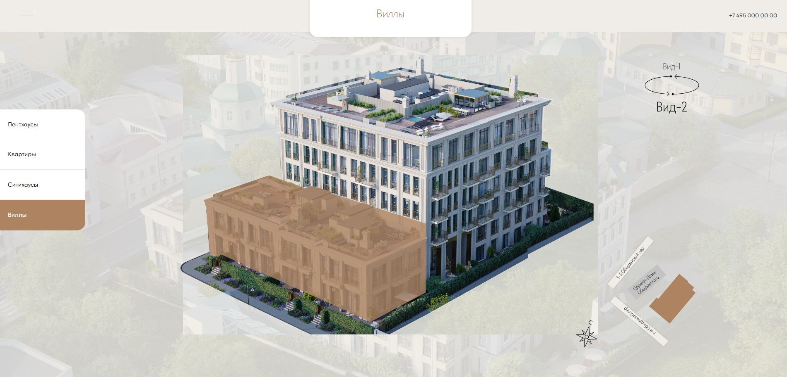

# Сайт ЖК для продажи недвижимости (главная страница)

## Информация о проекте

Мой проект - реализация главной страницы сайта жилищного комплекса. На ней
пользователи могут узнать об имеющихся вариантах недвижимости для покупки.

<details>
<summary>Подробнее</summary>
Варианты недвижимости показываются на здании в наглядной
форме, если кликнуть на интересующий пункт в навигационном меню сбоку. Также
можно получить информацию о стоимости и метраже, наведя курсором на определенный
участок здания. Он подсветится, и в специальном окне появится вся интересующая
пользователей информация. 


Здание жилищного комплекса можно поворачивать
(доступны Вид-1, Вид-2).


</details>

## Инструкции по сборке и запуску

1. Склонировать себе этот репозиторий

```
git clone https://github.com/NikolaiGavrilov/Residential-Complex-Housing-Selection
```
2. Перейти в директорию
```
cd Residential-Complex-Housing-Selection
```
3. Выполнить команду ниже для установки необходимых node_modules
```
npm i
```
4. Запустить сервер разработки, выполнив в терминале команду
```
npm run dev
```
5. Перейти на сайт, кликнув по появившейся в окне терминала ссылке левой кнопкой
   мыши с зажатой клавишей Ctrl или скопировать следующую ссылку в адресную
   строку в браузере и самостоятельно выполнить переход.
```
http://localhost:5173/
```
